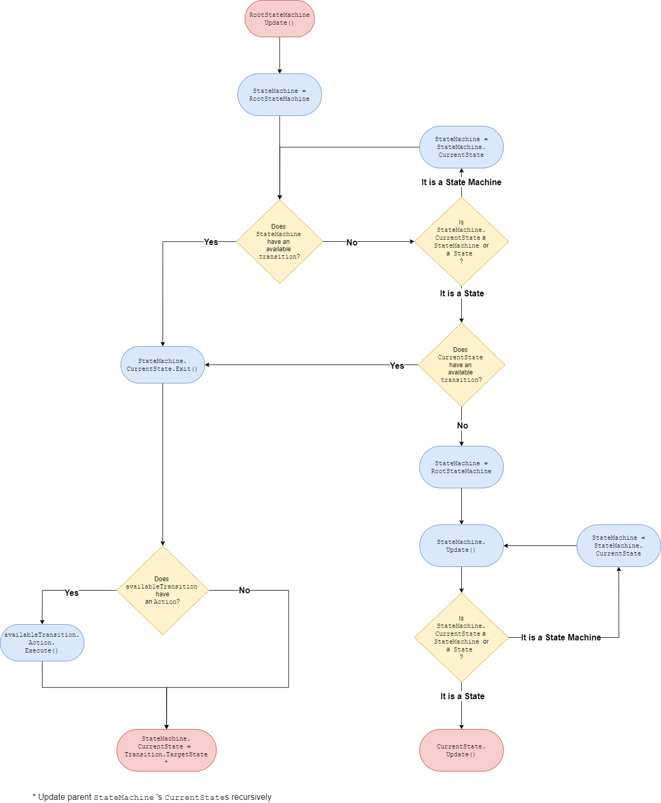

# Unity-Hierarchical-Finite-State-Machine

<div align="center">
	
	<br/>
	<a href = "https://github.com/AlexBlackfrost/Unity-Hierarchical-Finite-State-Machine/blob/main/LICENSE">
		
	</a>
	
</div>	

Hierarchical Finite State Machine Unity implementation.
## How to install
1. Open Unity and click ```Window```>```Package Manager```.
2. Click on ```+``` button and select ```Add package from git URL```.
3. Paste ```https://github.com/AlexBlackfrost/Unity-Hierarchical-Finite-State-Machine.git``` and click ```Add```.

## Features
### Class based architecture
State machines and states are implemented inheriting from ```StateMachine``` and ```State``` classes and overriding up to 5 different methods:
```cs
public class IdleState : State {

	protected override void OnEnter() { }
	protected override void OnExit() { }
	protected override void OnUpdate() { }
	protected override void OnFixedUpdate() { }
	protected override void OnLateUpdate() { }
}
```

### Nested states
```StateMachine```s also implement the same methods that ```State```s implement: ```OnEnter()```, ```OnExit()```, ```OnUpdate()```, ```OnFixedUpdate()``` and
```OnLateUpdate()```. State machines can be passed as states to another ```StateMachine```s:
<div align="center">
	
</div>

```cs
State idleState = new IdleState();
State walkState = new WalkState();
State attackState = new AttackState();
State deadState = new DeadState();

StateMachine movementStateMachine = new MovementStateMachine(idleState, walkState);
StateMachine aliveStateMachine = new AliveStateMachine(movementStateMachine, attackState);
StateMachine rootStateMachine = new RootStateMachine(aliveStateMachine, deadState);
```

### Transitions
There are two kinds of transitions: polling transitions and event transitions.

Polling transitions are evaluated every update cycle and event transitions are only evaluated when an event is fired.
```cs
// Examples
State idleState = new IdleState();
State walkState = new WalkState();

// Polling transition (old input system)
public bool IsMoving(){
	return Input.GetAxisRaw("Horizontal") != 0;
}
idleState.AddTransition(walkState, IsMoving);

// Event transition (new input system). AddEventTransition() returns an event listener that must be subscribed to an Action.
PlayerInput input = new PlayerInput();
input.CharacterControls.Move.performed += idleState.AddEventTransition(walkState);

```

By default, all ```EventTransition```s all evaluated together with polling transitions (```Transition```s) in the next update cycle,
so that ```EventTransition```s don't have priority over polling transitions. However, the parameter ```processInstantly``` can be set to ```true``` in order
to process the event as soon as it is listened. 

```cs
State walkState = new WalkState();
State jumpState = new JumpState();

StateMachine locomotionStateMachine = new locomotionStateMachine(walkState, jumpState);
PlayerInput input = new PlayerInput();

// After it is fired, the event will be processed the next time locomotionStateMachine.Update() is called.
input.CharacterControls.Jump.performed += walkState.AddEventTransition(jumpState, () => { return this.IsGrounded(); });

// This transition will be evaluated as soon as the event is fired
input.CharacterControls.Jump.performed += walkState.AddEventTransition(jumpState, true, () => { return this.IsGrounded(); });

```

### Transition actions
```Transition```s can also hold an ```Action``` that is executed when the conditions to perform the transition are met. Transition actions
are executed after exiting the current state and before entering the new one.

```cs
State walkState = new WalkState();
State jumpState = new JumpState();

StateMachine locomotionStateMachine = new locomotionStateMachine(walkState, jumpState);

walkState.AddTransition(jumpState, PlayJumpSFX, JumpPressed);

public void PlayJumpSFX(){
	jumpSFX.Play();
}

public bool JumpPressed(){
	return Input.GetKeyDown("space");
}


```

### Order of execution
The ```State``` and ```StateMachine```s hierarchy is executed in a top-down fashion, that is, the states higher in the hierarchy (those that are closer
to the root ```StateMachine```) are executed first, and their transitions are evaluated first.
<div align="center">
	
</div>